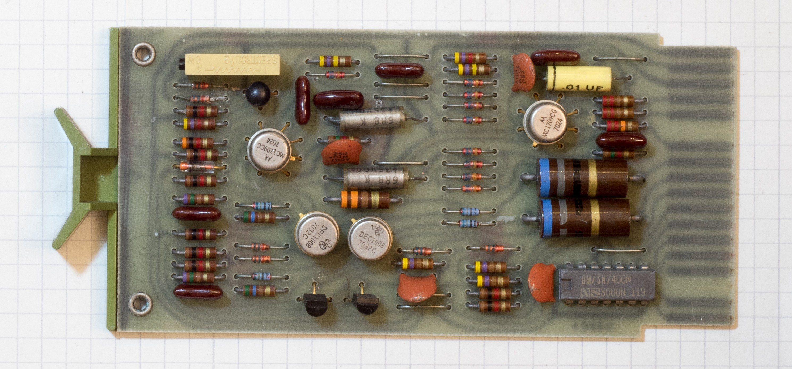
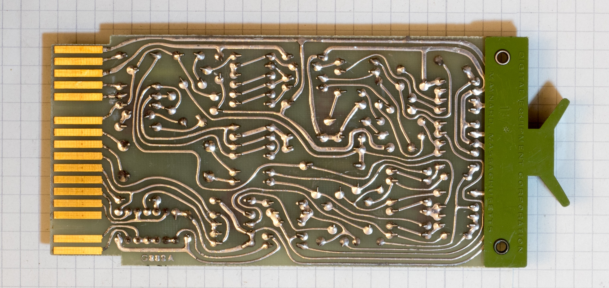

# G888-mk2
Replacement PCB for DEC G888 built with modern components. Drawn with KiCad 7.0.

Pictures of original card and documentation comes from Vince Slyngstad's excellent [flipchip page.](https://www.so-much-stuff.com/pdp8/flipchip/flipchip.php)

